<!-- ═══════════════════════════════════════════════════════════════════════ -->
<!--                        🎨  YASSA HALIM  —  GitHub Profile            -->
<!-- ═══════════════════════════════════════════════════════════════════════ -->

<div align="center">
  

  <a href="https://git.io/typing-svg">
    
  </a>
  
  <br><br>
  
  <a href="https://www.linkedin.com/in/yassa-halim/" target="_blank"></a>
  <a href="mailto:yassahalim18@gmail.com"></a>
  <a href="https://github.com/yassa-halim/yassa-halim/blob/main/Resume.pdf"></a>
</div>

<br>

## 👨‍💻 About Me

<table align="center" width="100%" style="border-collapse: collapse; border: none;">
<tr>
<td width="60%" valign="top" style="border: none;">

```dart
class YassaHalim extends FlutterDeveloper {
  final String name     = "Yassa Halim";
  final String role     = "Mobile Engineer";
  final String location = "Egypt 🇪🇬";

  List<String> get techStack => [
    "Flutter", "Dart", "Firebase"
  ];

  List<String> get architecture => [
    "Clean Architecture", "MVVM", "BLoC"
  ];

  Future<void> buildMasterpiece() async {
    while (coffeeLevel > 0) {
      await writeCleanCode();
      await craftPixelPerfectUI();
    }
  }
}
```

</td>
<td width="40%" valign="center" align="center" style="border: none;">
  
  <br><br>
  
</td>
</tr>
</table>

<br>

## 🛠️ Tech Arsenal & Badges

<div align="left">
  <h3>💎 Core & Mobile</h3>
  
  
  
  

  <h3>🧩 State Management & Architecture</h3>
  
  
  
  

  <h3>☁️ Backend & Tools</h3>
  
  
  
  

  <h3>🏅 Certifications</h3>
  
  
</div>

<br>

## 🚀 Featured Projects

<table align="center" width="100%" style="border: none;">
  <tr>
    <td align="center" width="50%" style="border: none;">
      <!-- استبدل yassa-halim باسم مستودع مشروعك الأول -->
      <a href="https://github.com/yassa-halim/yassa-halim"></a>
    </td>
    <td align="center" width="50%" style="border: none;">
      <!-- استبدل your-repo-name باسم مستودع مشروعك الثاني -->
      <a href="https://github.com/yassa-halim/your-repo-name"></a>
    </td>
  </tr>
</table>

<br>

## 📊 GitHub Analytics

<div align="center">
  
  
</div>

<br>

<div align="center">
  
</div>
