<!-- ═══════════════════════════════════════════════════════════════════════ -->
<!--                        🎨  YASSA HALIM  —  GitHub Profile            -->
<!-- ═══════════════════════════════════════════════════════════════════════ -->


## 📚 Table of Contents
- [About Me](#who-am-i)
- [Tech Stack](#tech-arsenal)
- [Project Showcase](#project-showcase)
- [Certificates & Awards](#certificates)
- [GitHub Stats](#github-analytics)
- [Contact](#lets-build-something-together)

<!-- ─────────────────────── TYPING ANIMATION ─────────────────────── -->

<div align="center">
  <a href="https://git.io/typing-svg">
    
  </a>
</div>

<br>

<!-- ═══════════════════════════════════════════════════════════════════════ -->
<!--                           ABOUT ME SECTION                            -->
<!-- ═══════════════════════════════════════════════════════════════════════ -->

<div align="center">
  
</div>

<div align="center">
  
</div>

##  &nbsp;Who Am I?

<table align="center" width="100%">
<tr>

<td width="50%" valign="top">

```dart
class YassaHalim extends FlutterDeveloper {

  final String name     = "Yassa Halim";
  final String role     = "Mobile Engineer";
  final String location = "Egypt 🇪🇬";

  List<String> get techStack => [
    "Flutter", "Dart", "Firebase"
  ];

  List<String> get architecture => [
    "Clean Architecture", "MVVM", "BLoC"
  ];

  Future<void> buildMasterpiece() async {
    while (coffeeLevel > 0) {
      await writeCleanCode();
      await craftPixelPerfectUI();
    }
  }

  String get motto => "Code is poetry written for humans 📝";
}
```

</td>

<td width="50%" valign="top" align="center">

<br>


<br><br>


</td>

</tr>
</table>

<!-- ─────────────────────── CURRENT STATUS ─────────────────────── -->

<div align="center">

|      🔭 Building      |    🌱 Learning     |  ⚡ Obsessed With  | 💬 Ask Me About |
| :-------------------: | :----------------: | :----------------: | :-------------: |
| Scalable Flutter Apps | CI/CD & Automation | Clean Architecture | Flutter & Dart  |

</div>

<br>

<div align="center">
  
</div>

<!-- ═══════════════════════════════════════════════════════════════════════ -->
<!--                          TECH STACK SECTION                           -->
<!-- ═══════════════════════════════════════════════════════════════════════ -->

##  &nbsp;Tech Arsenal

<div align="center">

<!-- CORE -->
<details open>
<summary><b>💎 Core</b></summary>
<br>


</details>

<!-- STATE MANAGEMENT -->
<details open>
<summary><b>🧩 State Management & Patterns</b></summary>
<br>


</details>

<!-- BACKEND -->
<details open>
<summary><b>☁️ Backend & Cloud</b></summary>
<br>


</details>

<!-- TOOLS -->
<details open>
<summary><b>🔧 Tools & DevOps</b></summary>
<br>


</details>

<!-- DESIGN -->
<details open>
<summary><b>🎨 Design</b></summary>
<br>


</details>

</div>

<!-- ═══════════════════════════════════════════════════════════════════════ -->
<!--                         GITHUB STATS SECTION                          -->
<!-- ═══════════════════════════════════════════════════════════════════════ -->

##  &nbsp;GitHub Analytics

<div align="center">
  
  &nbsp;
  
</div>

<br>

<div align="center">
  
</div>

<br>

<!-- ACTIVITY GRAPH -->
<div align="center">
  
</div>

<br>

<div align="center">
  
</div>

<!-- ═══════════════════════════════════════════════════════════════════════ -->
<!--                          TROPHIES SECTION                             -->
<!-- ═══════════════════════════════════════════════════════════════════════ -->

## 🏆 &nbsp;Achievement Showcase

<div align="center">
  
</div>

<br>

## 🚀 Project Showcase

<table align="center" width="100%">
  <tr>
    <td align="center" width="50%">
      <a href="https://github.com/yassa-halim/project1"></a>
      <br><br><strong>✨ Project 1</strong><br><i>تطبيق فلاتر مبني باستخدام Clean Architecture.</i>
    </td>
    <td align="center" width="50%">
      <a href="https://github.com/yassa-halim/project2"></a>
      <br><br><strong>🚀 Project 2</strong><br><i>تطبيق عالي الأداء مع تصميم (Pixel-Perfect UI).</i>
    </td>
  </tr>
</table>
<br>

<div align="center">
  
</div>


<!-- ═══════════════════════════════════════════════════════════════════════ -->
<!--                        TOP REPOS SECTION                              -->
<!-- ═══════════════════════════════════════════════════════════════════════ -->

## 🏅 Certificates & Awards

<div align="center">
  
  
</div>

## 📞 Contact

<div align="center">
  <a href="https://github.com/yassa-halim" target="_blank" rel="noopener"></a>
  <a href="https://linkedin.com/in/yassa-halim" target="_blank" rel="noopener"></a>
  <a href="mailto:yassahalim18@gmail.com" target="_blank" rel="noopener"></a>
</div>

## 📄 Resume

[](https://github.com/yassa-halim/yassa-halim/blob/main/Resume.pdf)

## 🔝 &nbsp;Top Contributed Repos

<div align="center">
  
</div>

<br>

<div align="center">
  
</div>

<!-- ═══════════════════════════════════════════════════════════════════════ -->
<!--                          SNAKE ANIMATION                              -->
<!-- ═══════════════════════════════════════════════════════════════════════ -->

## 🐍 &nbsp;Contribution Snake

<div align="center">
  <picture>
  <source media="(prefers-color-scheme: dark)" srcset="https://raw.githubusercontent.com/platane/snk/output/github-contribution-grid-snake-dark.svg" />
  <source media="(prefers-color-scheme: light)" srcset="https://raw.githubusercontent.com/platane/snk/output/github-contribution-grid-snake.svg" />
  
</picture>
</div>

<br>

<div align="center">
  
</div>

<!-- ═══════════════════════════════════════════════════════════════════════ -->
<!--                          DEV QUOTE SECTION                            -->
<!-- ═══════════════════════════════════════════════════════════════════════ -->

## 💭 &nbsp;Dev Wisdom

<div align="center">
  
</div>

<br>

<div align="center">
  
</div>

<!-- ═══════════════════════════════════════════════════════════════════════ -->
<!--                         CONNECT SECTION                               -->
<!-- ═══════════════════════════════════════════════════════════════════════ -->

##  &nbsp;Let's Build Something Together

<div align="center">

<a href="https://www.linkedin.com/in/yassa-halim/" target="_blank">
  
</a>
&nbsp;
<a href="mailto:yassahalim18@gmail.com">
  
</a>
&nbsp;
<a href="https://www.facebook.com/YassaHalim15/" target="_blank">
  
</a>
&nbsp;
<a href="https://instagram.com/yassa_halim" target="_blank">
  
</a>
&nbsp;
<a href="https://discord.gg/yassa_halim" target="_blank">
  
</a>
&nbsp;
<a href="https://behance.net/YassaHalim" target="_blank">
  
</a>

</div>

<br><br>

<!-- ═══════════════════════════════════════════════════════════════════════ -->
<!--                          FOOTER SECTION                               -->
<!-- ═══════════════════════════════════════════════════════════════════════ -->

<div align="center">
  
</div>

<div align="center">
  
</div>

<!--
ملاحظة: يمكنك استخدام الصور المحلية (stats.svg, top-langs.svg, trophies.svg) التي يتم تحديثها تلقائياً بواسطة GitHub Actions، وذلك بوضعها هكذا:

<div align="center">
  
  
  
</div>

-->
